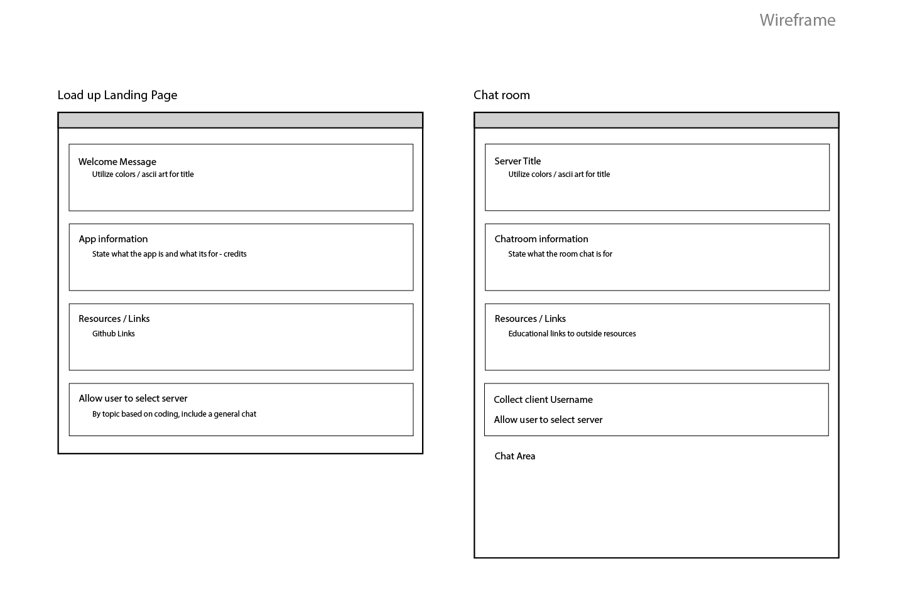
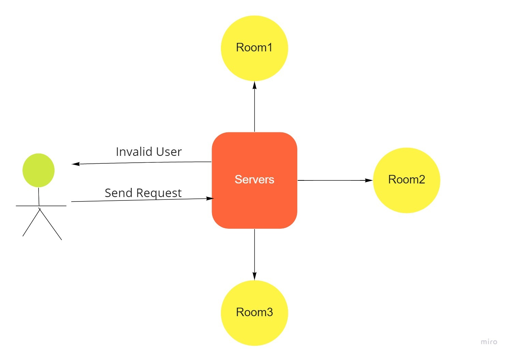

# Software Requirements

## Vision

Minimum Length: 3-5 sentences

What is the vision of this product?
    - A simple CLI chat program for developers written in Python.
    - Users can share information, links and communicate in the terminal.
    - Users can change rooms based on different topics/subjects.

What pain point does this project solve?
    - communication between developers.

Why should we care about your product?

## Scope (In/Out)

- IN: What will your product do
    - Users can create a userName
    - Users can switch between different servers/chat rooms
    - Users can communicate instantly while in the same server/chat room.
    - Users can share links

- OUT: What will your product not do.
    - Our application will never be a front-end web application. 
    - Our application will never turn into an IOS or Android app.

## Minimum Viable Product vs

What will your MVP functionality be?

- Landing page with app information and github links.
- Collect userName.
- Allow users to choose between different servers/chat rooms.
- Each server/chat room will have it's own title, information and links for that room.
- Allow chat between clients while in the same server/chat room.
- Predictive text/voice to text.
- Add ascii art to individual chat rooms.
- socketio

### Stretch

What stretch goals are you going to aim for?

- Youtube/Spotify Music playlist- listen to music while you chat with other users.
- Voice to text
- Add siri or Okay Google
- file sharing
- Add ability for Users to create a new chat room
- Add database
- Add images

## Functional Requirements

List the functionality of your product. This will consist of tasks such as the following:
    1. Users need to enter a userName before entering a chat room
    2. Users can swtich between rooms
    3. Users can type to communicate with other users

### Data Flow

Describe the flow of data in your application. Write out what happens from the time the user begins using the app to the time the user is done with the app. Think about the “Happy Path” of the application. Describe through visuals and text what requests are made, and what data is processed, in addition to any other details about how the user moves through the site.

1. User executes application.
2. Landing page displays with app title, info, and GitHub links to creators pages.
3. A list of selectable rooms displays at bottom of landing, prompting user to chose one.
4. User types in their room of choice.
5. User is then taken to their selected room.
6. Within the selected room; the room name title displays along with that specific rooms information, instructions on how to navigate chat, and helpful resource links.
7. User is then prompted to select a username.
8. Once user has selected a name, they receive a message in the terminal confirming they are ready to chat.
9. User can now send and receive messages within their command line.
10. When the user is ready to leave or switch rooms they will type a command such as 'quit'.
11. Choosing to quit will bring them back to the initial Landing where they can choose to exit the app or enter a new room.

## Non-Functional Requirements (301 & 401 only)

Pick 2 non-functional requirements and describe their functionality in your application.

1. Scalability: allows the application to remain stable for an estimated period into the future.
2. Reliability: allows the application to grow over time and permits the developers to focus on its core competencies.

If you are stuck on what non-functional requirements are, do a quick online search and do some research. Write a minimum of 3-5 sentences to describe how the non-functional requirements fits into your app.

You MUST describe what the non-functional requirement is and how it will be implemented. Simply saying “Our project will be testable for testibility” is NOT acceptable. Tell us how, why, and what.

update domain model with more MVPs - when user send request how it that request handled
make sure all software depends are in there
think about testing
add more strectch goals

## Assets

